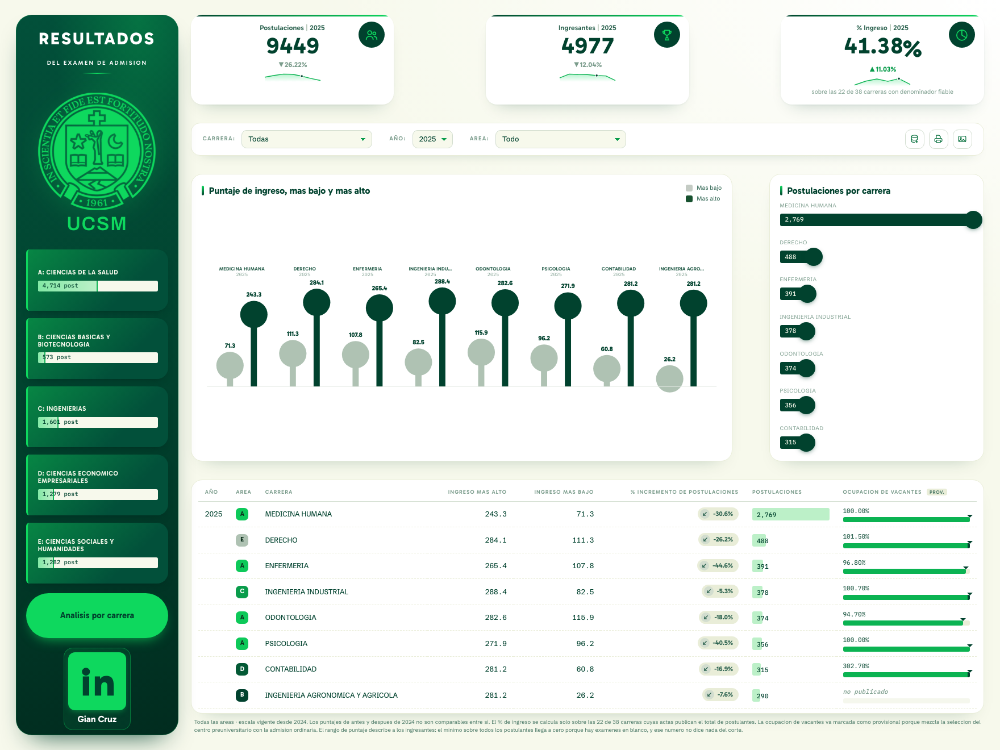
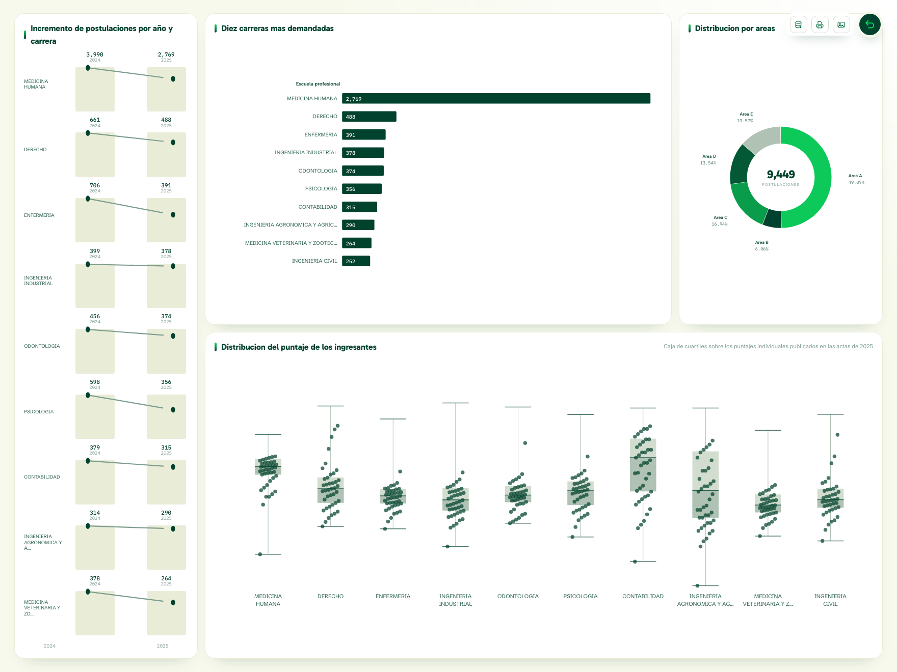

<h1>Admisión UCSM en Datos</h1>

**Siete ciclos de admisión de la Universidad Católica de Santa María, reconstruidos
desde 151 PDFs oficiales, verificados página a página y publicados como un tablero
que abre sin servidor.**

`2021 → 2027` · `71 627 filas extraídas` · `47 carreras` · `4 974 / 4 974 páginas contrastadas` · `0 fallas de auditoría` · `9 ADR`

|  |  |
|---|---|
| **Entra** | 151 PDFs de resultados y 30 documentos normativos. Dos generadores distintos, ocho esquemas de tabla, nombres de archivo que cambian de convención a mitad de la serie. |
| **Sale** | Seis CSV agregados y un tablero de dos hojas, interactivo, estático, sin backend ni cuenta externa. |
| **Se sostiene en** | Cuatro suites de verificación. Un segundo método de conteo, escrito aparte del parser, coincide con él en el 100.00 % de las páginas. |



### Lo que este conjunto de datos permite responder

- **Cuánto creció o cayó la demanda de cada carrera**, ciclo a ciclo, sin mezclar años.
- **Con qué puntaje se entra realmente** a cada programa, separando a quien ingresó del resto.
- **Por qué vía entra la gente**: examen ordinario, centro preuniversitario, a distancia, alto rendimiento, beca.
- **Qué tan cerca del corte se quedaron** los que no entraron.
- **Qué no se puede responder y por qué**, que en esta fuente es la mitad del trabajo.

Estado: **pipeline completo y auditado**, 15 etapas, cuatro suites de verificación en verde.

## Estructura

```
ExtraccionPDF/
  1_DescubrimientoDescarga.py    descubre por 3 vías, descarga con throttle
  2_AuditoriaCorpus.py           cuenta qué hay realmente dentro de cada PDF
  3_CatalogoCarreras.py          qué carreras se convocaron en cada ciclo
  4_Vacantes.py                  cuadro de vacantes por carrera y modalidad
  5_DocumentosBase.py            reglamentos, temarios, cronogramas y vacantes por año
  6_RescateHistorico.py          archivos fuera de convención de nombre
  7_RequisitosIngresantes.py     instructivos por proceso
  8_ExtraccionTablas.py          reconstrucción de filas por coordenadas
  9_NormalizacionDatos.py        esquema único + seudonimización (Silver)
  10_Agregados.py                6 CSV agregados (Gold), fuente del tablero
  11_Validacion.py               reconciliación contra las redundancias del PDF
  12_Auditoria.py                integridad del conjunto: cadena, pérdidas, privacidad
  13_PruebasCalidad.py           coherencia entre capas derivadas
  14_ContrasteIndependiente.py   segundo método de conteo, página a página
  15_PayloadTablero.py           serializa Gold + cuartiles en un JSON único
  16_PruebasTablero.py           contrasta el payload contra Gold y Silver
  data/
    manifest.csv                 153 filas: una por PDF de resultados descubierto
    auditoria.csv                151 filas: contenido real de cada PDF
    carreras_por_ciclo.csv       47 carreras × 7 ciclos
    vacantes.csv                 vacantes 2027 por carrera y modalidad
    documentos_base.csv          30 documentos normativos indexados
    raw/<ciclo>/                 151 PDFs de resultados por ciclo de admisión
    documentos_base/<año>/       vacantes, reglamento, temario, cronograma
    requisitos/<ciclo>/          instructivos de ingresantes por proceso
  data_extraida/                 71 627 filas por coordenadas, una carpeta por ciclo
  data_normalizada/              69 652 filas normalizadas + data_normalizada/gold/
tablero/                         aplicación React del tablero
  src/lib/data.js                selectores: KPI, series, áreas, cuartiles
  src/components/charts.jsx      los siete gráficos, en SVG propio
  src/App.jsx                    las dos hojas y las pestañas
  src/data/gold.json             payload que genera la etapa 15
docs/tablero.html                versión previa en un solo archivo HTML
docs/INVENTARIO.md               tabla detallada de los 151 PDFs
docs/ADR-001-paralelismo.md      por qué no se usa PySpark
docs/ADR-002-ventana-temporal.md por qué el corpus arranca en 2021
```

## Reproducir

```bash
pip install -r requirements.txt
python ExtraccionPDF/1_DescubrimientoDescarga.py   # ~5 min, 47 MB
python ExtraccionPDF/2_AuditoriaCorpus.py
python ExtraccionPDF/3_CatalogoCarreras.py
python ExtraccionPDF/5_DocumentosBase.py           # 22.9 MB de normativa
python ExtraccionPDF/4_Vacantes.py
python ExtraccionPDF/8_ExtraccionTablas.py         # ~9 s en paralelo, ADR-001
python ExtraccionPDF/9_NormalizacionDatos.py       # Silver: seudonimizado
python ExtraccionPDF/10_Agregados.py               # Gold: 6 CSV, fuente del tablero
python ExtraccionPDF/11_Validacion.py              # 10/10
python ExtraccionPDF/13_PruebasCalidad.py          # 10/10
python ExtraccionPDF/14_ContrasteIndependiente.py  # 4 974/4 974 páginas
python ExtraccionPDF/12_Auditoria.py               # 27 conformes, 0 fallas
python ExtraccionPDF/15_PayloadTablero.py          # regenera el payload del tablero
python ExtraccionPDF/16_PruebasTablero.py          # 15/15
```

Los PDFs no están versionados. Se reconstruyen con el primer script. `.env` necesita
`UCSM_SAL` antes de correr `9_NormalizacionDatos.py`; sin ella usa una sal de
desarrollo y el seudónimo no es reproducible entre máquinas.

## El corpus

151 PDFs de resultados y 30 documentos normativos, 61.1 MB, ciclos de admisión 2021 a 2027.

El **ciclo** es el año de ingreso declarado dentro del PDF, no el año en que se
rindió el examen: `EG2023I.pdf` dice *PRIMER EXAMEN ORDINARIO 2023* pero está
fechado el 29/08/2022. Un ciclo de admisión reúne entre 12 y 16 procesos
repartidos entre el año anterior y el año de inicio de clases.

### Tres vías de descubrimiento

Ninguna sola alcanza:

| Vía | Aporte | Por qué hace falta |
|---|---|---|
| Wayback CDX | 190 | Cubre lo histórico. Desactualizado en 2026-2027. |
| Sondeo de nombres | +16 | Rellena nombres predecibles. Se agota rápido. |
| Página web con navegador | +16 | Única que ve los nombres nuevos. |

En 2026 UCSM cambió la convención: de `EG2026I.pdf` pasaron a
`RESULT_ORDINARIO_2027.pdf`, `Resultados_2026_IIIORDINARIO.pdf`,
`Resul_PrecaIII.pdf`. Esos nombres no se adivinan, y el WAF del sitio devuelve
403 a cualquier cliente que no sea un navegador real.

## Lo que limita el análisis

Estos límites son de la fuente, no del procesamiento. Están aquí porque
determinan qué preguntas tienen respuesta y cuáles no.

**Dos familias de PDF.** 108 archivos salen del generador del sistema de
admisión, que usa fuentes subset con ToUnicode, y 43 de Excel o Word con object
streams. Se leen distinto, así que el parser reconoce el esquema por sus
rótulos en vez de asumirlo.

**Ocho esquemas distintos.** El más completo es
`Condición | Código | Nombre | Nota 01 | Nota 02 | Ord. | Total`, en 53
archivos. El más pobre es `Condición | Nombre | Ord. | Total`, en 26. Otros
54 no exponen un encabezado uniforme y se resuelven por coordenadas.

**El `Código` desaparece progresivamente.** Está en el 97% de las filas de 2021
y en el 100% de 2023 y 2024, cae al 81% en 2025, al 11% en 2026 y a cero en
2027. Seguir a la misma persona entre procesos, que es lo que habilita el
análisis de cohortes, solo es viable **hasta 2025**.

### Por qué la serie empieza en 2021

Porque antes la UCSM no publicaba estos resultados en la web. No es una
decisión de alcance: es donde empieza la fuente.

Se verificó con seis métodos independientes, entre ellos el índice CDX del
Internet Archive sobre el dominio completo, el índice de Common Crawl y el
rastreo de las convenciones de nombre que la universidad fue usando. Ninguno
devuelve resultados de exámenes generales anteriores al ciclo 2021. Lo que sí
existe de antes son reglamentos y temarios, que no son resultados.

Los 91 PDFs previos a 2021 que se habían descargado en la exploración inicial
se eliminaron por eso. El detalle está en `docs/ADR-002-ventana-temporal.md`.

### Desde 2026 solo se publica a quien ingresa

Hasta 2025 los PDFs listaban a todos los postulantes con su condición, así que
se podía calcular la tasa de admisión real. A partir de 2026 la universidad
cambió de criterio y publica únicamente a los admitidos.

| Ciclo | Ingresantes | No ingresantes | Tasa calculable |
|---|---|---|---|
| 2021 | 3 033 | 4 333 | sí |
| 2022 | 5 117 | 4 865 | sí |
| 2023 | 4 832 | 7 590 | sí |
| 2024 | 5 741 | 7 149 | sí |
| 2025 | 4 977 | 4 472 | sí |
| **2026** | **4 715** | **498** | **no** |
| **2027** | **1 697** | **0** | **no** |

De los 22 PDFs de 2026 apenas 4 traen rechazados, y ninguno de los 6 de 2027.
No faltan archivos: están los 28 y cubren los nueve tipos de proceso. Lo que
falta es el dato, porque el documento dejó de traerlo.

La consecuencia es concreta. **De 2026 en adelante se puede decir cuántos
entraron y con qué puntaje, pero no qué tan difícil fue entrar**, porque no se
conoce el número de postulantes. Los agregados marcan esos ciclos con
`denominador_fiable = 0` para que ningún tablero los grafique como si la
exigencia hubiera bajado.

### Cobertura por ciclo

| Ciclo | Ordinarios | Precatólica | Distancia | Extraordinarios | Total |
|---|---|---|---|---|---|
| 2021 | 3 | 4 | — | 5 | 21 |
| 2022 | 4 | 7 | — | 5 | 28 |
| 2023 | 3 | 6 | 3 | 5 | 25 |
| 2024 | 3 | 3 | 3 | 4 | 27 |
| 2025 | 3 | 5 | 4 | 1 | 22 |
| 2026 | 5 | 2 | 3 | 1 | 22 |
| 2027 | 2 | 1 | — | 1 | 6 |

Estudios a Distancia no aparece en 2021 ni 2022 porque la modalidad se creó en
2023. 2027 es el ciclo en curso: se completa conforme UCSM publique.

**Por qué desde 2021 y no desde 2016.** La UCSM no publicó los exámenes
generales antes de ese ciclo. Verificado con seis métodos independientes; el
detalle está en `docs/ADR-002-ventana-temporal.md`.

## Procesamiento

Dieciséis etapas, todas reproducibles. Los PDFs no se versionan: se reconstruyen.

| Etapa | Script | Salida |
|---|---|---|
| Descubrir y descargar | `1_DescubrimientoDescarga.py` | 151 PDFs de resultados |
| Auditar el corpus | `2_AuditoriaCorpus.py` | qué trae cada PDF |
| Catálogo de carreras | `3_CatalogoCarreras.py` | 47 carreras × 7 ciclos |
| Cuadro de vacantes | `4_Vacantes.py` | plazas por carrera y modalidad |
| Base normativa | `5_DocumentosBase.py` | reglamentos, temarios, cronogramas |
| Rescate histórico | `6_RescateHistorico.py` | archivos sin convención de nombre |
| Instructivos | `7_RequisitosIngresantes.py` | 22 documentos por proceso |
| **Extracción de tablas** | `8_ExtraccionTablas.py` | **71 627 filas** por coordenadas, bloque a bloque |
| Normalización (Silver) | `9_NormalizacionDatos.py` | 69 652 filas, 47 carreras, seudonimizadas |
| Agregados (Gold) | `10_Agregados.py` | 6 CSV, fuente del tablero |
| Reconciliación | `11_Validacion.py` | 10 pruebas en DuckDB |
| Auditoría integral | `12_Auditoria.py` | cadena, pérdidas, privacidad |
| Calidad entre capas | `13_PruebasCalidad.py` | 10 pruebas de coherencia Silver ↔ Gold |
| Contraste independiente | `14_ContrasteIndependiente.py` | segundo método, página a página |
| Payload del tablero | `15_PayloadTablero.py` | un JSON con agregados y cuartiles |
| Pruebas del tablero | `16_PruebasTablero.py` | 15 contrastes del payload contra Gold y Silver |

### Verificación

Cuatro suites. Ninguna se ajustó para pasar: cada vez que una falló, se
corrigió el parser o se documentó por qué la fuente es así.

| Suite | Qué pregunta | Resultado |
|---|---|---|
| `11_Validacion.py` | ¿La salida es fiel a las redundancias del PDF? | 10/10 |
| `13_PruebasCalidad.py` | ¿Las capas derivadas son coherentes? | 10/10 |
| `14_ContrasteIndependiente.py` | ¿Un segundo método cuenta lo mismo? | **4 974/4 974 páginas** |
| `12_Auditoria.py` | ¿El conjunto se sostiene? | 27 conformes, 0 fallas |
| `16_PruebasTablero.py` | ¿El tablero muestra lo que dice la fuente? | **15/15** |

Las tres primeras miden cosas distintas. `11_Validacion.py` usa las
redundancias que el propio documento publica: si el parser asignara mal una
columna, la aritmética dejaría de cerrar sola. Dos de sus pruebas **abren el
PDF de origen**: cuando el orden de mérito salta un número, comprueban si el
ordinal tampoco está en el documento. Los nueve casos resultaron ser omisiones
de la fuente, que retira gente de una lista ya ordenada sin renumerar.

`13_PruebasCalidad.py` mira más arriba: integridad referencial, que la fecha del
examen caiga en la ventana de su ciclo, que Gold sume lo mismo que Silver, que
el seudónimo no colisione, y que reejecutar produzca el mismo archivo byte a
byte.

`14_ContrasteIndependiente.py` responde la pregunta que las otras dos no pueden.
Ambas leen los datos por el mismo camino, así que un error consistente en toda
una página las pasa de largo. Esta cuenta las filas **sin usar el parser**: donde
él reconstruye la tabla por coordenadas de carácter, ella toma el texto plano y
lo mide con expresiones regulares. Si los dos caminos llegan al mismo número en
cada una de las 4 974 páginas, el desacuerdo tendría que ser una coincidencia.

Arrancó en 97.58% y cada punto que faltaba era un hallazgo real, entre ellos
5 523 filas que se perdían porque una tabla continúa en la página siguiente sin
repetir el encabezado. También corrigió a la propia prueba tres veces: cuando
dos métodos difieren, el equivocado puede ser cualquiera de los dos. El detalle
está en `docs/ADR-008-contraste-independiente.md`.

`12_Auditoria.py` revisa el conjunto: que cada etapa conserve lo que recibió,
que no salga ningún dato personal en lo versionado, y que **todo PDF sin filas
tenga una explicación verificada**. Los 15 que no producen datos son 9 listas de
aptitud, 5 instructivos y 1 duplicado; la auditoría los clasifica leyendo el
propio documento y falla si aparece uno sin explicar.

### «Apto» no es «ingresó»

El hallazgo que ninguna prueba de integridad podía dar, porque todos los
números cerraban.

La UCSM publica dos clases de documento que se parecen. Uno lista quién puede
rendir el examen; el otro, quién ingresó. Los dos usan la palabra `APTO`: en un
acta se opone a `NO INGRESO` y significa admitido; en una lista previa se opone
a `NO APTO` y solo significa que la persona reúne los requisitos para
presentarse.

Traducir las dos con el mismo diccionario convertía en ingresantes a **414
personas que solo estaban habilitadas para dar el examen**. Cada fila era fiel a
su PDF; el error estaba en el modelo. Ahora la clase del documento decide qué
significa la palabra, y las 2 048 filas de las 28 listas de aptitud quedan fuera
del conteo de admisiones sin salir del conjunto de datos.

## Tablero

`tablero/` es una aplicación React que lee un único JSON generado por la etapa 15.
No hay backend, ni base de datos, ni consultas en vivo: el navegador carga los
agregados y todo el filtrado ocurre en el cliente.

```bash
cd tablero
npm install
npm run dev        # desarrollo
npm run build      # estático, listo para publicar en cualquier hosting
```

**Dos hojas, con pestañas al pie como un dashboard publicado.** Todo cabe en una
pantalla: nada desplaza la página, y solo la tabla de detalle tiene scroll propio.

| Hoja | Qué muestra |
|---|---|
| **HOME** | Tres indicadores con su variación interanual, barra de filtros, rango de puntaje de ingreso por carrera, postulaciones por carrera y tabla de detalle con ocupación de vacantes. |
| **ANÁLISIS POR CARRERA** | Pendiente de postulaciones entre dos ciclos, diez carreras más demandadas, reparto por área y caja de cuartiles del puntaje de los ingresantes. |

Los cinco paneles están enlazados: un clic en cualquier gráfico, en la tabla o en
el anillo de áreas filtra a los demás, y el filtro activo se puede quitar desde la
barra superior. Lo que está en pantalla se descarga en CSV.



Los gráficos son SVG escrito a mano, sin librería de charts, para que el color, la
escala y las etiquetas salgan de los mismos tokens que el resto de la interfaz.
Cada hoja tiene enlace propio: `#home` y `#analisis`.

### El rango de puntaje describe a los ingresantes

Un detalle que parece cosmético y no lo es. El mínimo sobre **todos** los
postulantes de Medicina Humana en 2025 es `1.11`, y está en el PDF: alguien rindió
el examen y sacó eso. Pero graficarlo junto al máximo sugiere que se entró con ese
puntaje, y es falso.

| Medicina Humana | Todos los postulantes | Solo ingresantes |
|---|---|---|
| 2024 | 1.07 → 280.8 | **132 → 280.8** |
| 2025 | 1.11 → 243.3 | **71 → 243.3** |

El tablero grafica la segunda columna, que es la que responde la pregunta que la
gente trae. La distribución completa sigue disponible en la capa Gold.

### Identidad visual

Todo el color del tablero sale de tres valores muestreados del logo oficial de la
universidad, y nada mas:

| Token | Hex | Dónde manda |
|---|---|---|
| Verde hondo | `#01422E` | columna institucional, marcas de máximo, texto principal |
| Verde vivo | `#0ED85E` | escudo, acentos, barras de avance |
| Hueso | `#F7F9EC` | fondo del lienzo y relleno de los medidores |

Los demás tonos del tablero son mezclas de esos tres, declaradas como tokens en
`src/index.css`. No entra ningún color ajeno a la marca: por eso una caída
interanual no se pinta de rojo, sino que la dirección la carga la flecha y la
fuerza la carga el verde.

Tipografía: Instrument Serif en los títulos, Bricolage Grotesque en las cifras y
rótulos, Instrument Sans en el texto corrido, IBM Plex Mono en las columnas de
números.

### El tablero no inventa nada

`16_PruebasTablero.py` recalcula desde cero cada cifra que el tablero enseña y la
compara con Gold y Silver. No mira el código de la interfaz: mira el JSON que la
interfaz consume.

Comprueba, entre otras cosas, que cada fila cuadre con el agregado, que la
variación interanual reproduzca la división, que la caja de cuartiles se sostenga
sobre los puntajes individuales de los ingresantes, que la ocupación de vacantes
cruce sin pérdidas, y que **las 235 combinaciones de carrera y ciclo que el
catálogo marca como convocadas tengan su fila**. Ninguna falta.

Las 47 carreras no se convocan todos los años: 47 × 7 dan 329 combinaciones
posibles y solo existen 244. Cuando se filtra por una carrera y un año sin actas,
el tablero lo dice y nombra los ciclos donde sí la hay, en vez de devolver una
pantalla vacía.

### Privacidad del payload

El JSON se arma desde Gold y, solo para los cuartiles, desde la capa Silver. De
ahí salen agregados y 40 puntos muestreados por cuantiles: ningún identificador,
ni siquiera el seudónimo, cruza al cliente.

## Decisiones de arquitectura

Registradas en `docs/`, con la medición que las sostiene.

**ADR-003 · Hallazgos de la validación.** Cuatro errores de modelo que la
reconciliación destapó: `Nota Mínima` no es la nota de corte sino el mínimo
institucional, faltaban las dimensiones de sede y grupo (aparecieron ocho
sedes), el corte no se puede calcular mezclando modalidades porque cada una usa
su escala, y en Medicina aprobar el examen da `TEST + ENTREVISTA` y no
`INGRESO`.

**ADR-001 · Paralelismo.** La etapa de extracción usa `ProcessPoolExecutor` con
8 procesos: 40.8 s en serial contra 9.3 s en paralelo sobre los 221 PDFs.
PySpark queda descartado porque arrancar la JVM tarda más que el trabajo
completo, y porque la eficiencia cae a 55% en 8 procesos, señal de que el
cuello de botella es ancho de banda de memoria local y no cómputo distribuible.
El umbral que revertiría la decisión está escrito en el ADR. Reproducible con
`python ExtraccionPDF/bench_paralelismo.py`.

## Datos personales

Los PDFs traen nombre completo y, hasta 2025, código de documento. Que UCSM los
publique no habilita a republicarlos consolidados.

- Los nombres se descartan en la ingesta.
- El código se reemplaza por `HMAC-SHA256(código, sal)` truncado, que conserva
  la trazabilidad entre procesos sin exponer el documento. La sal va en `.env`.
- `data_extraida/` está en `.gitignore`.
- Solo se publican agregados por carrera, modalidad y ciclo.

## Base normativa

30 documentos oficiales de 2021 a 2027, en
`data/documentos_base/<año>/`:

| Documento | Cobertura | Para qué sirve |
|---|---|---|
| `vacantes.pdf` | 2021-2027, completo | Plazas por carrera y modalidad. Es el denominador. |
| `temario.pdf` | 2021-2027, completo | Qué se evalúa. Explica saltos en las notas. |
| `reglamento.pdf` | 2021, 2022, 2024, 2026, 2027 | Reglas del proceso. Los PDFs citan sus artículos. |
| `cronograma.pdf` | 2022-2027 | Fechas oficiales de cada proceso. |

El cuadro de vacantes reparte las plazas entre cinco vías de ingreso. Para 2027:

| Modalidad | Vacantes |
|---|---|
| Exámenes ordinarios | 2 654 |
| Centro preuniversitario (CEPRE I-II-III) | 1 434 |
| Concurso extraordinario | 1 201 |
| Vacantes PRONABEC | 188 |
| Traslado interno | 90 |
| **Total** | **5 567** |

Cruzar esto contra los ingresantes reales de cada proceso da la tasa de
ocupación de plazas por carrera y modalidad.

## Catálogo de carreras

47 carreras distintas entre 2021 y 2027. La oferta no es fija: **Ingeniería en
Inteligencia Artificial** e **Ingeniería Biomédica** aparecen recién en el ciclo
2026; **Turismo y Hotelería** dejó de convocarse después de 2021. Una serie
temporal por carrera tiene que distinguir "no se convocó" de "nadie postuló", y
para eso está `carreras_por_ciclo.csv`.

## Fuente

Dirección de Admisión, Universidad Católica de Santa María — ucsm.edu.pe
Enumeración histórica vía Internet Archive Wayback CDX API.
Este análisis no es institucional ni está avalado por la UCSM.
